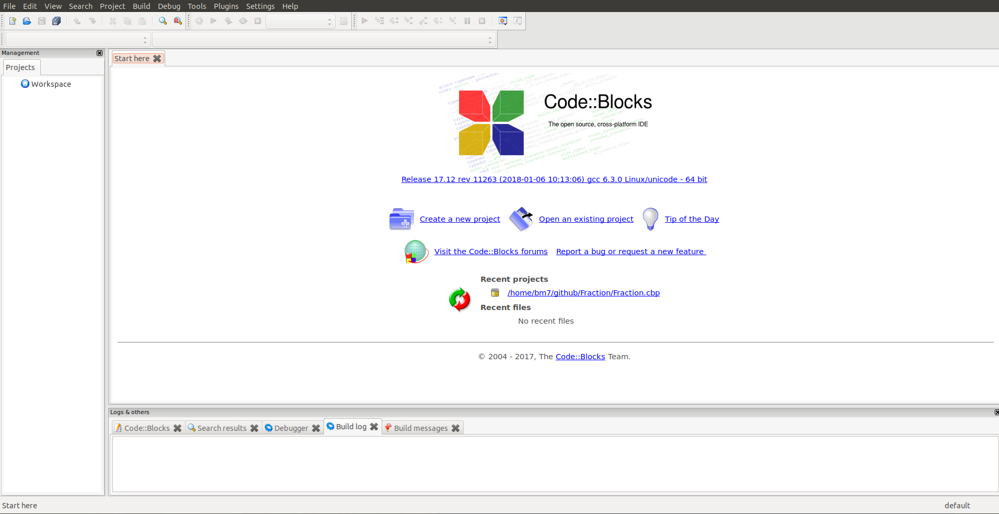

# Pointer Associated Classe CPP
Pointer associated with class in c++



## Usage

### Set up environment

```bash
# For Ubuntu with GCC --verison >= 4
$ wget https://kent.dl.sourceforge.net/project/codeblocks/Binaries/17.12/Linux/Debian%20stable\
/codeblocks_17.12-1_amd64_stable.tar.xz
# In case you can not download without certificate
$ wget --no-check-certificate https://kent.dl.sourceforge.net/project/codeblocks/Binaries\
/17.12/Linux/Debian%20stable/codeblocks_17.12-1_amd64_stable.tar.xz

$ tar codeblock_17.12-1_amd64_stable.tar.xz
$ sudo dpkg -i *17.12*.deb
```

### Launch

```bash
$ codeblock
```


### Clone
```bash
$ git clone https://github.com/bm777/Pointer-Class-CPP.git
```

